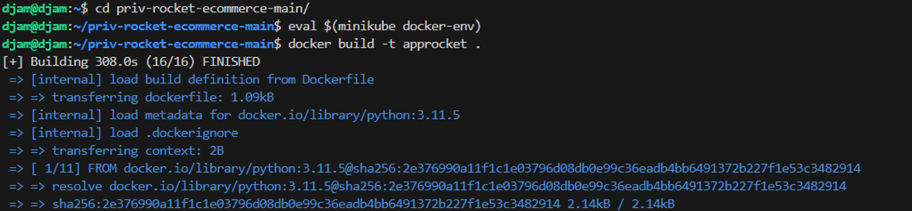
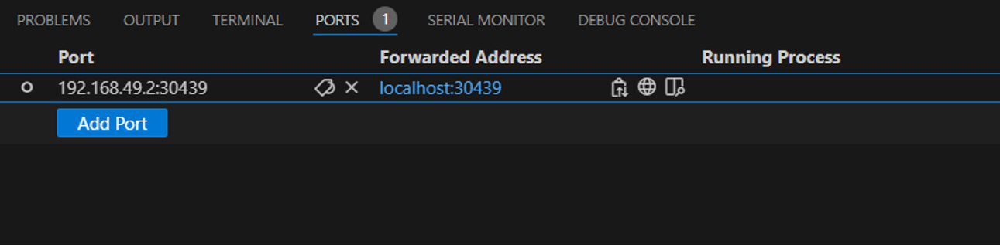
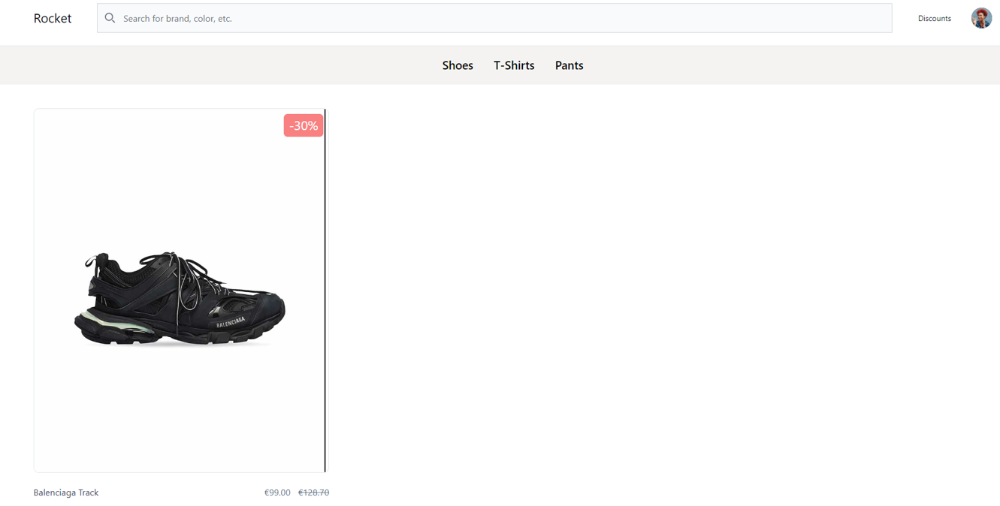
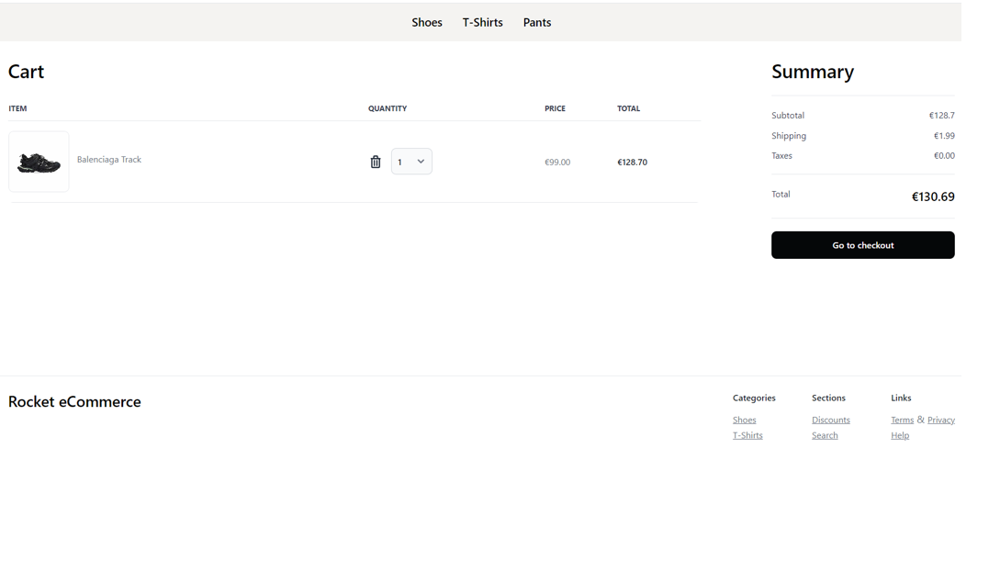
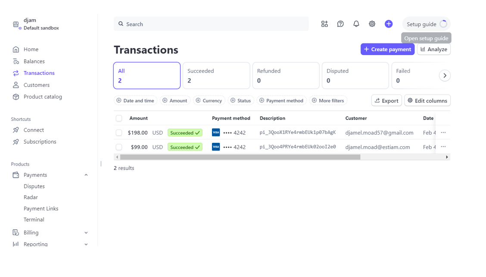

 # E5VIRTDC
Djamel MOAD Rendue 

# E5-CCISP
Djamel MOAD Rendue 


<!-- PROJECT LOGO --> <br /> <div align="center"> <h3 align="center">Projet Kubernetes : Applications e-commerce </h3> <p align="center"> 
<a href="https://github.com/app-generator/ecommerce-django-stripe"><strong>Documentation E-commerce django stripe</strong></a> <br /> 
<a href="https://docs.stripe.com/checkout/quickstart">Documentation Stripe premier pas</a> · 
<a href="https://github.com/app-generator/ecommerce-flask-stripe">Documentation Ecommerce Flask Stripe</a> · 


<!-- TABLE OF CONTENTS --> <details> <summary>Table des matières</summary> <ol> <li><a href="#structure-du-projet">Structure du projet</a></li> <li><a href="#configurations">Configurations</a></li><li><a href="#etape-du-build">Étape du build</a></li> <li><a href="#logs">Logs</a></li> <li><a href="#quelques-interfaces">Quelques Interfaces</a></li> </ol> </details>


<!-- ABOUT THE PROJECT -->
## Struture du projet

Voici la structure du projet:

Composants Utilisés

Kubernetes
Pods : Conteneurisation des applications
Deployments : Gestion des versions et des mises à jour
Services : Exposition des applications sur le réseau
Ingress : Gestion du trafic sur les ports 80 et 443
ConfigMaps : Stockage des fichiers d'environnement non sensibles
Secrets : Stockage des informations sensibles (ex : clés API Stripe)
Namespaces : Isolation des environnements (Dev et Prod)
HPA (Horizontal Pod Autoscaler) : Scalabilité automatique selon la charge
Volumes persistants : Stockage des données sensibles de l'application

```bash
<p align="right">(<a href="#readme-top">back to top</a>)</p>
<< HOME [SSH: 192...] >
   |
   |-- djam/
   |    |-- .cache/
   |    |    |-- Microsoft/
   |    |         |-- motd.legal-displayed
   |    |
   |    |-- .docker/
   |    |-- .kube/
   |    |    |-- cache/
   |    |    |-- config
   |    |
   |    |-- .minikube/
   |    |-- .ssh/
   |    |-- .vscode-server/
   |    |-- priv-rocket-ecommerce-main/
   |    |
   |    |-- .bash_history
   |    |-- .bash_logout
   |    |-- .bashrc
   |    |-- .profile
   |    |-- .sudo_as_admin_successful
   |    |-- .wget-hsts
   |    |
   |    |-- manifestr.yaml

```

<p align="right">(<a href="#readme-top">back to top</a>)</p>

<!-- FILES CONFIGURATIONS -->
## Configurations

. Contenu du manifest.yaml

``` apiVersion: v1
kind: Namespace
metadata:
  name: rocket-eval
---
apiVersion: v1
kind: ConfigMap
metadata:
  name: rocket-configmap
  namespace: rocket-eval
data:
  DEMO_MODE: "True"
  DEBUG: "True"
---
apiVersion: v1
kind: Secret
metadata:
  name: stripe-secret
  namespace: rocket-eval
type: Opaque
# Pour mettre les secrets en claires, il faut utiliser "stringData:", sinon, il va falloir les hasher en base64
stringData:
#data:
  STRIPE_PUBLISHABLE_KEY: pk_test_51QoNZERYe4rmbEUk1Jm8WCMrulfLLLjOCxg1l1fm54NUmXnm6W5pF3CxIGHVDoWb6isC9grZ7RkUFWSrsZ0WUFl500sXiUqbVg
  STRIPE_SECRET_KEY: sk_test_51QoNZERYe4rmbEUkWFws4qlaYLrdik4bDQRlGwMJk7mhPRdhD2Z5dPCSSWXa2riKlKUnGH3HdIu0lG50i9JcLlCi00VyKsxHqA
---
apiVersion: apps/v1
kind: Deployment
metadata:
  name: rocket-deployment
  namespace: rocket-eval
  # Labels du deployment
  labels:
    app: django
    env: preprod
    tier: frontend
spec:
  selector:
    matchLabels:
      app: django
  replicas: 1
  template:
    metadata:
      # Labels des pods
      labels:
        app: django
        env: preprod
        tier: frontend
    spec:
      containers:
      - name: rocket-random
        image: approcket:latest
        imagePullPolicy: IfNotPresent
        resources:
          requests:
            memory: 64Mi
            cpu: 250m
          limits:
            memory: 128Mi
            cpu: 400m
        envFrom:
        - configMapRef:
            # nom de la configMap
            name: rocket-configmap
        env:
          # nom de la variable qui sera injectée
          - name: STRIPE_PUBLISHABLE_KEY
            valueFrom:
              secretKeyRef:
                # nom de l'objet secret
                name: stripe-secret
                # nom du secret précis
                key: STRIPE_PUBLISHABLE_KEY
          - name: STRIPE_SECRET_KEY
            valueFrom:
              secretKeyRef:
                name: stripe-secret
                key: STRIPE_SECRET_KEY
---
apiVersion: v1
kind: Service
metadata:
  # name: django-new-service
  name: rocket-service
  namespace: rocket-eval
spec:
  type: LoadBalancer
  selector:
    app: django
  ports:
  - port: 5005
    targetPort: 5005
    # nodePort: 30001
    name: django-np
---
apiVersion: networking.k8s.io/v1
kind: Ingress
metadata:
  name: ingress-rocketapp
  namespace: rocket-eval
spec:
  defaultBackend:
    service:
      name: rocket-service
      port:
        number: 7777
---
apiVersion: autoscaling/v2
kind: HorizontalPodAutoscaler
metadata:
  name: rocket-hpa
  namespace: rocket-eval
spec:
  scaleTargetRef:
    apiVersion: apps/v1
    kind: Deployment
    name: rocket-deployment
  minReplicas: 1
  maxReplicas: 5
  metrics:
  - type: Resource
    resource:
      name: cpu
      target:
        type: Utilization
        averageUtilization: 50

```

<!-- GETTING STARTED -->
## Etape du build

### Pour déployer les applications du répertoire "devoir":

Définition de l'architecture : Identification des composants et interactions

Configuration de Kubernetes : Mise en place des namespaces, deployments, services

Intégration de Stripe : Configuration de l'API avec secrets et configMaps

Gestion du scaling : Implémentation du HPA pour ajuster dynamiquement le nombre de pods

Tests de charge : Simulation de trafic et mesure des performances

Monitoring et Logging : Configuration de Prometheus et Grafana pour observer l'utilisation des ressources

Documentation et résultats : Explication des choix et analyse des performances

<!-- INTERFACES -->
## Quelques interfaces


. Deploiment minikube commande


. Deploiment docker et application 

. Redirection de port 


. Page d'acceuil application 

. Pade presentation produits

. Page de paiement 

. Transation sur stripe 



## Choix des frameworks


Django & Flask : Frameworks légers et efficaces pour le développement web

Stripe : Simplifie l'intégration des paiements

Rocket Django : Solution robuste et bien structurée pour des projets évolutifs


